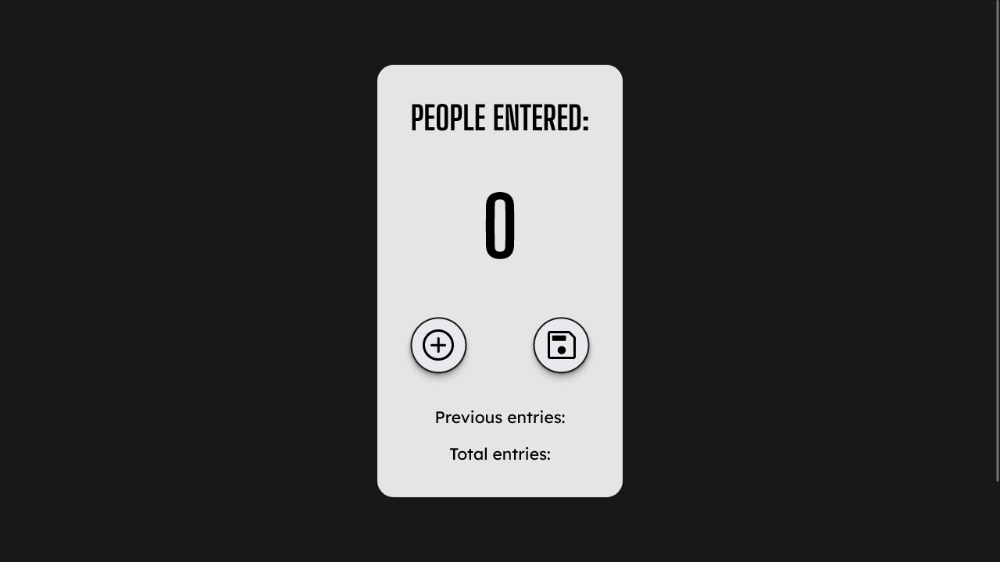

# Scrimba - subway-passenger-counter solution

This is a solution to the [subway-passenger-counter challenge on Scrimba](https://scrimba.com/learn/learnjavascript/).

## Table of contents

- [The challenge](#the-challenge)
- [Screenshot](#screenshot)
- [Links](#links)
- [Built with](#built-with)
- [Author](#author)

### The challenge

Users should be able to:

- Count how many people entered in the subway station
- Save the previous entries
- Save the total entries

### Screenshot

### Links

- Solution URL: [@GitHub](https://github.com/xdelmo/subway-passenger-counter)
- Live Site URL: [@GitHub](https://htmlpreview.github.io/?https://github.com/xdelmo/subway-passenger-counter/blob/master/index.html)

### Built with

- Semantic HTML5 markup
- CSS custom properties
- Flexbox
- Mobile-first workflow
- Vanilla Javascript

## Author

- Website - [Emanuele Del Monte](https://www.emanueledelmonte.com)
